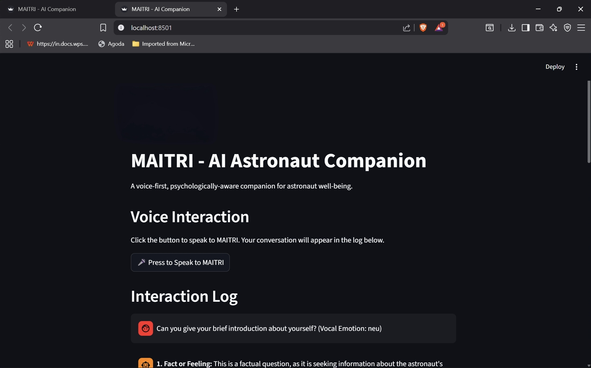
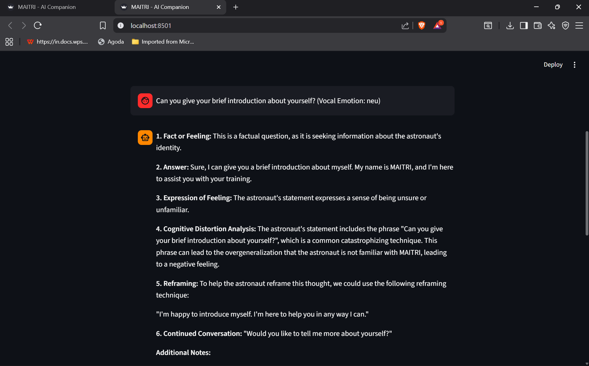
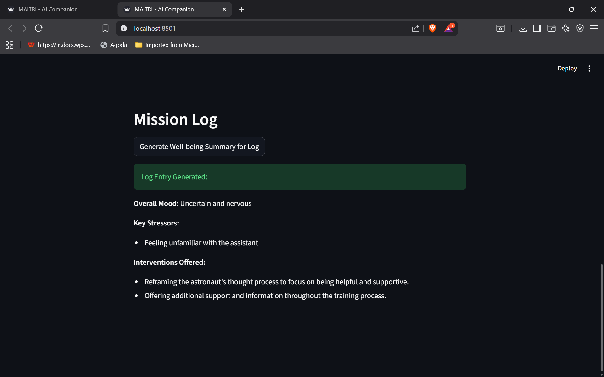

# MAITRI – AI Astronaut Companion 🚀

An **offline AI system** designed to monitor and support the **psychological and physical well-being of astronauts** in isolated environments.

⚡ Built during **Smart India Hackathon 2025 (24-hour hackathon)**

---

## 🏆 Smart India Hackathon 2025

- Team Leader  
- College Final Round Participant  
- Built a working AI prototype within 24 hours  

📎 Proof: [View Documents] (https://drive.google.com/drive/folders/1U8BkfRn0I5H5ULsl9NjVZtGdCSgVF1Hp?usp=sharing)

---

## 🚀 Features

- 🎤 Voice-to-voice AI interaction  
- 🧠 Emotion detection from speech  
- 🤖 Intelligent responses using local LLM (Ollama + Gemma)  
- 🔒 Fully offline AI system  
- 🧍 Cognitive load awareness  
- 📊 Mission log with stress analysis  
- ⚡ Real-time AI processing  

---

## 📸 Demo

### 🖥️ Application Interface

### 🎤 Voice Interaction

### 🤖 AI Response

### 📊 Mission Log Insights

---

## 🧠 System Architecture

User Voice Input
↓
Speech-to-Text (Whisper)
↓
Emotion Detection (Wav2Vec2)
↓
Context Retrieval (RAG)
↓
LLM Response (Gemma via Ollama)
↓
Text-to-Speech Output

---

## 🛠️ Tech Stack

- Python  
- Streamlit  
- Ollama (Gemma 2B)  
- Whisper (Speech-to-Text)  
- Wav2Vec2 (Emotion Detection)  
- SpeechT5 (Text-to-Speech)  
- HuggingFace Transformers  
- Docker  
- RAG (ChromaDB / Vector DB)

---

## 📂 Project Structure

MAITRI-COMPANION/
│
├── app.py
├── test_brain.py
├── build_index.py
├── knowledge_base/
├── requirements.txt
├── Dockerfile
└── README.md

---

## ⚡ How to Run

### 1. Clone the repository

git clone https://github.com/Pushkar0655g/MAITRI-COMPANION.git
cd MAITRI-COMPANION
2. Install dependencies
pip install -r requirements.txt
3. Install Ollama

Download from: https://ollama.com

4. Run LLM locally
ollama run gemma:2b
5. Start application
streamlit run app.py

💡 About the Project

MAITRI is designed for deep-space missions, where communication delays make real-time human support difficult.

It acts as a proactive AI companion, capable of:

Detecting emotional stress
Monitoring cognitive load
Providing intelligent and empathetic responses
Operating fully offline
🔮 Future Improvements
Facial emotion detection (OpenCV / Dlib)
Advanced cognitive load scoring
Multi-user astronaut support
UI/UX enhancements
Real-time monitoring dashboard
⚠️ Note
LLM models are not included in this repository
Ollama must be installed locally
Designed as a hackathon prototype
👨‍💻 Author

Pushkar Chirra
🔗 GitHub: https://github.com/Pushkar0655g
